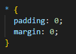
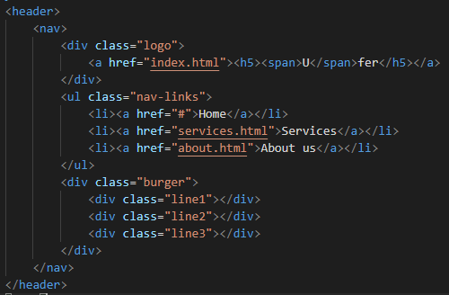
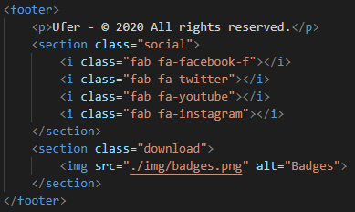
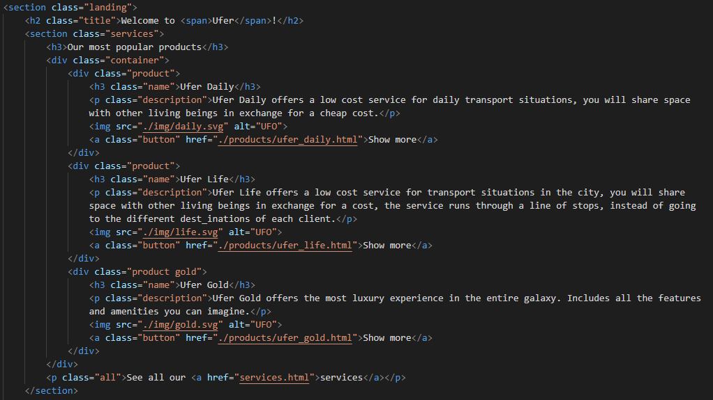
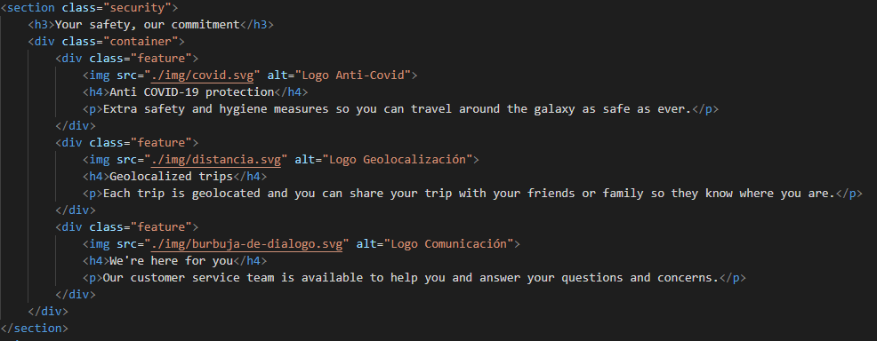
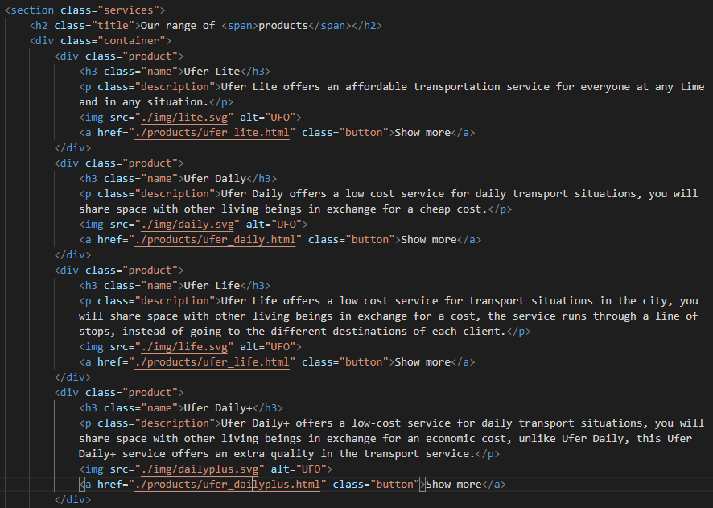
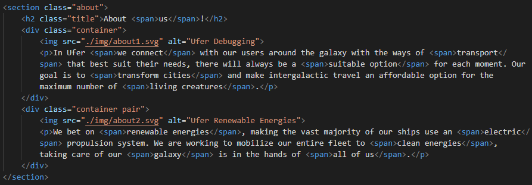
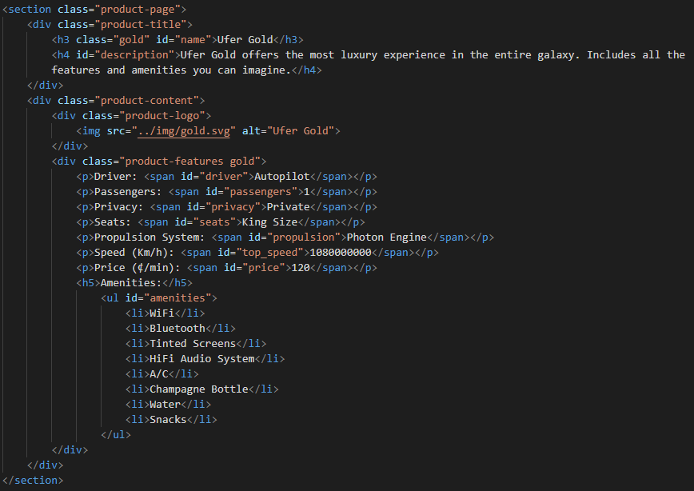

# Scrapper tool for Ufer Website

Comenzamos el proyecto diseñando la página web, ya que nuestra herramienta trabaja sobre ella.

## Página web

Teníamos claro que queríamos hacer un buen trabajo con la página web, dándole al diseño la importancia que se merece. Nuestro objetivo era conseguir una página web que transmita cierta profesionalidad, con un diseño agradable y cómodo para el usuario, sin sobrecargar la página de contenido.

Para ello es muy importante tener en cuenta ciertas características como la armonía, utilizando una paleta de colores consistentes y una tipografía adecuada.

### Recursos y herramientas

A continuación, voy a mencionar algunas herramientas y recursos que hemos utilizado en nuestra página.

##### Normalize.css:

Cada navegador aplica unos estilos propios por defecto, como por ejemplo, márgenes, tamaños de fuente, etc. La solución rápida que suele utilizarse es añadir algo así:

Normalize es mucho más potente, regulariza los estilos y hace que nuestra página se vea igual independientemente del navegador donde se visualice.
La forma de aplicarlo es tan sencilla como descargar un archivo css que pesa apenas 8KB y enlazarlo a nuestro html.

##### Font Awesome:

Es una de las formas más sencillas de añadir iconos a nuestra página, trabajar con ellos es muy cómodo, ya que lo único que hay que hacer es importarlo en el head de nuestra página y después para usar cada icono utilizamos un elemento i con una clase específica. También hace muy sencillo modificarlos en color y tamaño.

##### Google Fonts:

En nuestra opinión, la mejor página para utilizar fuentes sin necesidad de instalarlas. En su página seleccionamos todas las fuentes que queramos utilizar y automáticamente nos generará un enlace personalizado para importarlas todas.

##### Storyset:

Es una herramienta de Freepik (startup española), que nos brinda una gran cantidad de ilustraciones en formato .svg que podemos personalizar para hacerlos encajar perfectamente en nuestra página, para hacer uso de ellos solo debemos descargarlos e instalarlos en nuestra página atribuyendo al autor.

### Componentes de la página web

Vamos a descomponer la página en componentes para explicar el funcionamiento de cada uno de ellos. Comenzaremos por los componentes comunes en todas las páginas.

#### Header

La estructura del header es bastante sencilla, un elemento nav que contiene un div con el logo, una lista desordenada con los links al resto de páginas y un “botón” que se mostrará cuando la página se visualice en un dispositivo móvil, reemplazando la lista desordenada, hasta que hagamos click sobre el botón para desplegarla.

#### Footer

El footer es muy simple también, un párrafo con un pequeño texto, un section con iconos que son enlaces a las redes sociales y un section con una imagen del típico botón para descargar la aplicación móvil (no funcional).

#### Main

El apartado main es básicamente el único contenido que cambia según la página:

##### Index

El index se divide en dos secciones:

El “landing”, donde aterrizas cuando entras en la página. Que tiene un mensaje de bienvenida y un contenedor con tres de nuestros servicios más populares, cada uno tiene un botón que es un enlace que te lleva a la página del producto en sí. Abajo del contenedor tiene un pequeño texto con un enlace que nos lleva al resto de productos.

Y la sección “security ” tiene algunos cuadros de texto acompañados de un icono, donde hablamos un poco de las medidas de seguridad que tomamos.

##### Services

En la sección de servicios tenemos un título y un contenedor que contiene un div para cada uno de los productos, cada div tiene forma de tarjeta y contiene el nombre del servicio, una descripción, una imagen y un enlace para ir a su página con el resto de características.

##### About

En la página de about us solo tenemos un par de divs que son un texto acompañado de una imagen, además en el texto tenemos varios span, a los que luego cambiamos el estilo para resaltarlos.

##### Página de producto

En la página de producto tenemos una sección product-page que contiene un el div product-title, que contiene el título y descripción del producto. Al mismo nivel tenemos product-content, que contiene la imagen del producto y sus características. Las características están en un elemento p, y la información que queremos scrapear se encuentra en un span para poder encontrarlo mediante su id. Además tenemos una lista de pequeñas características que también queremos scrapear

#### Responsive

Consideramos que actualmente es indispensable que cualquier página web sea mínimamente responsive, y que debe visualizarse correctamente sin importar el dispositivo utilizado. Para esto utilizamos los @media, indicando a partir de que cierta anchura han de modificarse los estilos. En nuestra página hemos tratado de conseguir que la visualización sea correcta a cualquier anchura.

## Config

Disponemos del módulo de configuración de la herramienta y disponemos de cuatro apartados a configurar.

En el primer apartado **DOMAIN** aportamos el url del dominio de la página de la que queremos scrapear contenido.

En el segundo apartado **DEPTH** se indica la recursividad máxima de la profundidad del sitio web a la que se quiere acceder.

En el tercer apartado **KEYS** indicamos las palabras clave a la hora de encontrar el identificador del contenido a scrapear.

En el cuarto apartado **TYPE** aportamos como queremos tratar los datos de los identificadores indicados anteriormente.

## Crawler

Una vez el módulo **CONFIG** haya quedado con el contenido especificado, el módulo **CRAWLER** tomará esos valores como configuración para extraer las páginas a scrapear

Comenzando por extraer el contenido de una página web, procederemos a hacer un request al **DOMAIN** especificado anteriormente con la función **get_content**, utilizando la librería **requests** necesaria para el funcionamiento de la herramienta. Request mediante el protocolo HTTP nos devolverá un “Response” con el contenido en formato “string” del código **HTML** de la página web.

Una vez dispongamos del contenido comienza el módulo **web_crawler** a extraer los enlaces que conforman el sitio web del **DOMAIN** especificado, según la **DEPTH** aportada **web_crawler** profundizará más o menos en la búsqueda de enlaces.

El módulo **web_crawler** está compuesto por varias funciones:

- **`get_next_target`**: Se encarga de buscar los enlaces en el contenido HTML (“<a href=”) y una vez localizado devuelve el enlace y su posición final.
- **`union`**: Es la función encargada de unir 2 listas(p y q), añadiendo el contenido de q que no está en p.
- **`get_all_links`**: Se encarga mediante la función get_next_target de extraer todos los enlaces de una página completa, recorre el contenido HTML y añade a una lista los enlaces encontrados.
- **`is_for_scrapp`**: Función encargada de comprobar si en un enlace hay contenido que nos interesa scrapear o no, para ello utiliza los valores aportamos en **KEYS** del módulo **CONF**, devuelve un valor booleano.
- **`repair_link`**: Función encargada de “reparar” links inválidos(falta de http) ya que en nuestra web los enlaces están indicados con rutas relativas a documentos HTML, **repair_link** añade el dominio indicado en **UFER_DOMAIN** justo delante de la ruta relativa, permitiendo así acceder a ella con un **request**.

## Scrapper

El módulo scrapper es el encargado de extraer el contenido de las páginas web obtenidas por el módulo **CRAWLER**.

**Scrapp** es la función principal, comienza creando un diccionario a partir de los valores aportados en **CONFIG**, el diccionario está compuesto por **KEYS** y **TYPE**, este diccionario es usado posteriormente para tratar los valores extraídos de diferentes formas.

El módulo scrapp está compuesto por varias funciones:

* **`scrapp`**: Como anteriormente está explicado esta es la función principal del módulo y esta recorre los valores aportados en **KEYS** de **CONF**, forma un identificador con las keys. 
Ya que en la web está estructurado el contenido a scrappear con los identificadores antepuestos, el contenido a scrappear está contenido justo después del identificador y antes del cierre “<”.
* **`int_detector`**: Esta función detecta si el valor extraído es un string o, en caso de todo el contenido ser numérico, considerarlo un íntegro y añadirlo como tal.
* **`string_to_list`**: Función encargada de extraer el contenido de una lista HTML y convertirla en un array, con los respectivos valores de la lista.

## Repository

Es el módulo que contiene los archivos relacionados con la conexión a la base de datos.

### To Mongo

Es el encargado de hacer la conexión con la base de datos e introducir cada documento en la colección indicada. Cada diccionario obtenido mediante **SCRAPPER** será un documento en la colección.

### Schema Validation

Hemos decidido crear un esquema de validación para nuestra colección. Hemos declarado que lo campos requeridos serán name, description y precio, y que serán tipo string, string y entero, respectivamente.

## Diagrama de componentes

## Conclusiones

La idea para nuestro proyecto era bastante ambiciosa teniendo en cuenta nuestras competencias y el tiempo del que disponíamos, aún así, estamos muy orgullosos del resultado. Hemos conseguido hacer una página web bien diseñada bajo nuestro punto de vista, hemos creado una herramienta que recoge todos los enlaces de nuestra página y una que obtiene todos los datos que necesitamos y los introduce en un diccionario. Finalmente, hemos realizado una conexión con MongoDB en la que subimos todos nuestros diccionarios como documentos en una colección.

### Posibles mejoras

Estas son algunas de las ideas que pensamos en introducir en nuestro proyecto y finalmente no nos ha sido posible:

- **GUI**: Nos gustó mucho la idea de implementar una simple interfaz gráfica para nuestra aplicación, desde donde podríamos modificar los parámetros de configuración dependiendo de la página a scrapear, en lugar de hacerlo desde el archivo de configuración.

- **Productos y servicios**: Al inicio del proyecto consideramos si nosotros realmente queríamos ofrecer productos específicos, como podría ser un UFO específico o si realmente queríamos ofrecer servicios. Pensamos que al cliente podría interesar contratar un servicio que le garantice una serie de especificaciones. De igual manera que plataformas como Uber ofrecen un servicio con una serie de características y tipo de coche, pero no un modelo y marca específica. En una etapa madura de nuestro proyecto pensamos que una buena refactorización sería introducir diferentes flotas, donde también crearíamos los modelos específicos y en la base de datos especificaríamos a que flota o servicio podría pertenecer cada modelo específico de UFO.

### Principales dificultades encontradas

Dada nuestra prácticamente nula experiencia hemos encontrado dificultades durante el comienzo del desarrollo, ya que comenzar a desarrollar y que funcionara nos distrajo de hacerlo siguiendo unas buenas prácticas, como por ejemplo hacer TDD.
Otra dificultad grande que nos hemos encontrado es la gestión del tiempo, ya que nunca nos habíamos enfrentado a un proyecto de esta magnitud, nos ha sido difícil tener una buena gestión y organización del tiempo, no hemos dividido correctamente y de forma equitativa el trabajo a realizar.
